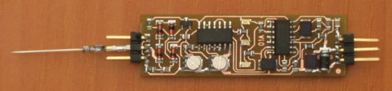

# TTLPROBE01A - Logic probe

The logic probe displays the H and L logic states and the indeterminate X state of TTL logic on three LEDs. The logic probe displays short pulses on the input so that they are visible."

 
            
